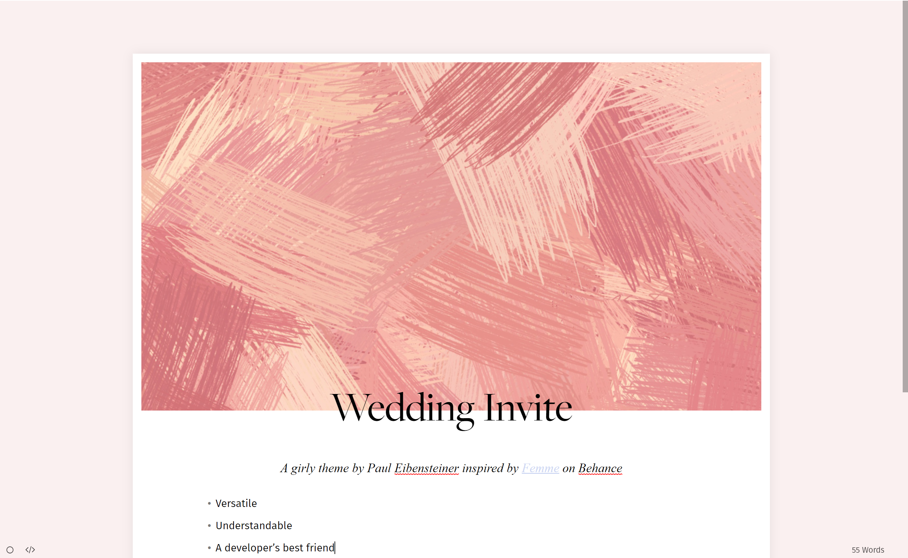

# Wedding Inivite

*A Typora Theme, code inspired by [Ursine](https://github.com/noatpad/typora-theme-ursine)*

Fonts FiraGo, Majesti Banner, Freight Big Pro and Fira Mono not included for legal reasons.

## Compilation

- [Install NPM and Gulp](https://coder-coder.com/install-gulp-globally-on-windows/)
- Install Gulp locally
- If there are deprecation errors:
  - delete the `node_modules` folder and all package references inside `package.json` (remember them)
  - Reinstall all packages using `npm install --save-dev ...`, where `...` is the package
- Use `gulp dev` to develop and `gulp release` to put zipped resulting css into `release` folder
